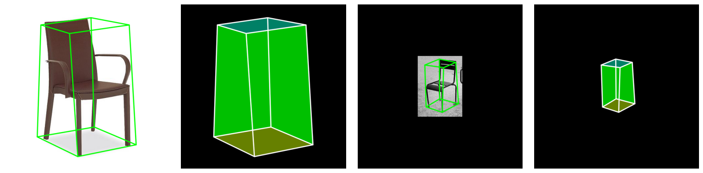

# 3D Chair Detection using YOLOX in mmdetection

## 🧊 Monocular 3D Object Detection

## 🪑 Keypoints-based 3D Reconstruction

[](https://www.python.org)
[](https://pytorch.org)


  

---

## 🧭 Dataset Overview

Total train images: 5007 / Total val images: 500

✅ 10 corner points (transformed to 10 bounding boxes)

---

## 🏗️ Model Architecture

- 🧊 Model: **YOLOX**
- 🧊 Weight: **"yolox_l_8x8_300e_coco"**
- 🧊 Framework: **PyTorch + mmdetection**
- 🧊 Input Size: **640, 640**
- 🧊 Trained Epochs: **6**

---

## 📊 Final Performance
```
 Average Precision  (AP) @[ IoU=0.50:0.95 | area=   all | maxDets=100 ] = 0.325
 Average Precision  (AP) @[ IoU=0.50      | area=   all | maxDets=1000 ] = 0.533
 Average Precision  (AP) @[ IoU=0.75      | area=   all | maxDets=1000 ] = 0.353
 Average Precision  (AP) @[ IoU=0.50:0.95 | area= small | maxDets=1000 ] = 0.275
 Average Precision  (AP) @[ IoU=0.50:0.95 | area=medium | maxDets=1000 ] = 0.344
 Average Precision  (AP) @[ IoU=0.50:0.95 | area= large | maxDets=1000 ] = -1.000
 Average Recall     (AR) @[ IoU=0.50:0.95 | area=   all | maxDets=100 ] = 0.657
 Average Recall     (AR) @[ IoU=0.50:0.95 | area=   all | maxDets=300 ] = 0.657
 Average Recall     (AR) @[ IoU=0.50:0.95 | area=   all | maxDets=1000 ] = 0.657
 Average Recall     (AR) @[ IoU=0.50:0.95 | area= small | maxDets=1000 ] = 0.635
 Average Recall     (AR) @[ IoU=0.50:0.95 | area=medium | maxDets=1000 ] = 0.664
 Average Recall     (AR) @[ IoU=0.50:0.95 | area= large | maxDets=1000 ] = -1.000
```

---

## 🔑 Summary
  
✅ Applied mostly default configs  
✅ **Note** Not bad bbox results.  
✅ Applied intensive post-processing

---

## ⭐ Acknowledgements

- YOLOX powered by `mmdetection`
- Dataset by Roboflow

---
